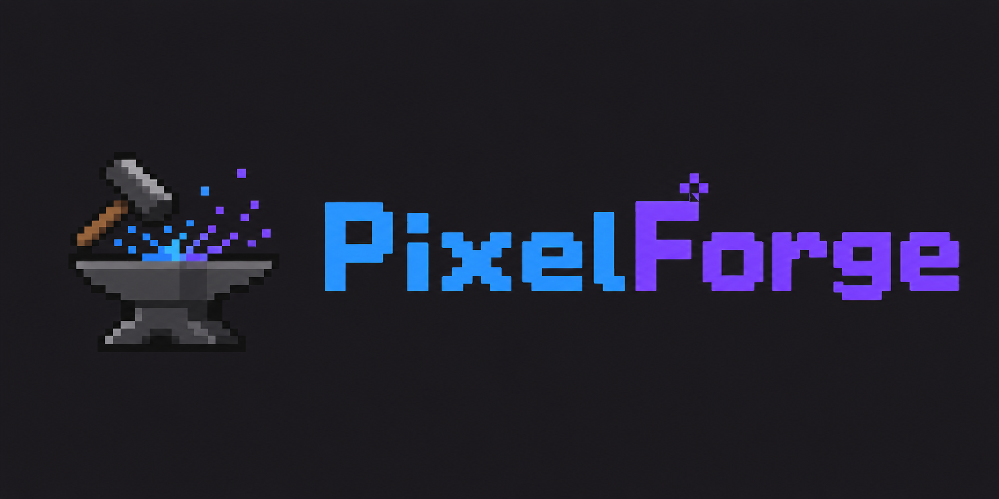

<p align="center">
  
</p>

<h1 align="center">PixelForge</h1>
<p align="center"><i>An agent-native pixel art studio — humans + agents, one canvas.</i></p>

<p align="center">
  <a href="https://pixelforge-webmcp.netlify.app/"><b>▶ Live app</b></a> ·
  <a href="#testing-instructions-for-judges"><b>How to test</b></a> ·
  <a href="#webmcp-tools"><b>19 WebMCP tools</b></a> ·
  <a href="LICENSE"><b>MIT License</b></a>
</p>


> A pixel art editor built from scratch so that an AI agent can operate it as a **first-class user** — not generate pictures for you, but actually *use the software*, side by side with you, on the same canvas.

**Submission for the [OpenAI WebMCP Challenge](https://webmcp.devpost.com/).** Built entirely during the Submission Period (Aug 25 – Sep 3, 2026) — see the [commit history](https://github.com/EndPx/pixelforge/commits/main) for evidence.

---

## Testing instructions for judges

**No login or account is needed — the app is free and open.**

1. **ChatGPT desktop app (recommended):** open `https://pixelforge-webmcp.netlify.app/` in ChatGPT's in-app browser, then ask ChatGPT:
   > *"Create a cute green slime with a face, then turn it into a 4-frame idle animation."*
   The 19 registered tools appear under **Site tools** in the address bar; every tool call streams into the **Agent Activity** panel on the right.
2. **Google Chrome 149+:** enable `chrome://flags/#enable-webmcp-testing`, relaunch, open the same URL — the header badge flips to **"WebMCP live · 19 tools"**.
3. **Any other browser (manual QA):** the page exposes an honest debug bridge (not WebMCP):
   ```js
   __pixelforge.listTools()
   await __pixelforge.call("draw_pixels", { pixels: [{ x: 5, y: 5, color: "#38b764" }] })
   ```

The demo video link is on the Devpost submission page.

---

## Why this is a strong fit for WebMCP

**The problem:** AI "editors" today are one-shot generators. You prompt, they hand you a file, and *you* fix it by hand. The agent never touches the actual software, so iteration means regenerating everything — and losing whatever you liked.

**Why a pixel editor is the right shape for WebMCP:** pixel art is 100% structured state — a grid of colors, layers, frames, and a palette. That maps *exactly* onto tool schemas: an agent doesn't need vision or guesswork to "see" the canvas; it can read exact pixel data via `get_region`, then act through the same primitives a human uses. Creative tools are also naturally **iterative** — the value is in small, targeted edits ("move the eyes down one pixel"), which is precisely what structured tools enable and what one-shot generation cannot do.

**What people and agents can now do together (difficult or impossible before):**

- **Shared state, zero handoff.** The agent draws layer 3 while you refine layer 2 — same canvas, same editor, live. Previously you'd generate an image, import it, and lose the agent's ability to make targeted edits.
- **Contextual edits instead of regeneration.** *"The eyes are too big — make them smaller and shift them down"* becomes `get_region` → `erase_pixels` → `draw_pixels` on the existing artwork, not a re-roll of the whole image.
- **A shared, auditable history.** Every agent operation flows through the *same* action layer as the human UI — so it appears in the activity feed with an `AGENT` badge and is fully **undoable** by the human. Trust comes from visibility: you watch every tool call land on your canvas.
- **Batched precision.** The agent places 167 pixels in one `draw_pixels` call; recolors the whole animation in one `replace_color`; exports a finished sprite sheet via `export_sprite_sheet`.

## How WebMCP is implemented

Registration happens at page load via the standard imperative API:

```js
document.modelContext.registerTool({
  name: "draw_pixels",
  description: "Draw one or many pixels at once on the pixel canvas…",
  inputSchema: { type: "object", properties: { pixels: { … }, layer: { … } }, required: ["pixels"] },
  execute: async (input) => {
    /* validate → call the same store action as the human UI → return structured JSON */
  },
});
```

Key implementation decisions:

- **One action layer, two users.** All 19 tools call the same Zustand store actions as the mouse/keyboard (`drawPixels`, `floodFill`, `createFrame`, `moveRegion`…). There is no separate "AI drawing" code path — which is why agent edits are history-tracked, replayable, and visually identical to human edits.
- **Structured results & errors.** Every tool returns `{ success, operation, detail, … }` or `{ success: false, error: { code, message } }` (`INVALID_COORDINATE`, `LAYER_NOT_FOUND`, `NO_SELECTION`, …) so the agent can reason about failures instead of guessing.
- **Strict JSON schemas** with batched operations (`draw_pixels` takes an array — no one-tool-call-per-pixel), layer/frame references resolvable **by id or name**, and idempotent operations (`replace_color` twice ⇒ zero changes).
- **Honest availability.** When the WebMCP API is absent, the badge shows *"WebMCP inactive"* and nothing is faked; a clearly-labeled debug bridge exists for manual QA only.
- **Verified by tests:** 38 unit tests cover editor actions and tool contracts (schema validity, batched draws, structured errors, undoability of agent mutations).

## Features

**Human editor (Aseprite/LibreSprite-inspired):** pencil / eraser / flood fill / color picker / rect select / move / hand; fg/bg colors with right-click painting and swap (`X`); brush shapes (circle/square/line) sized 1–64px; pixel-perfect strokes; cel-matrix **timeline** (layers × frames) with playback and FPS control; **onion skinning**; floating live **preview**; ready-made palettes (Sweetie 16, PICO-8, DB16) with sort & gradient tools; "new palette from sprite"; tiled drawing mode; pixel grid toggle; pan (hand tool / space / scrollbars); zoom to 6400%; PNG / **animated GIF** / sprite-sheet export; localStorage save/load.

**Agent surface:** 19 WebMCP tools below, a live **Agent Activity** panel showing every tool call with `HUMAN`/`AGENT` badges, structured success/error results, and full undoability of agent edits.

## WebMCP tools

| Category | Tool | Description |
|---|---|---|
| Read | `get_editor_state` | Canvas size, frames, layers, palette, selection |
| Read | `get_region` | Compact legend + grid of a region's pixels |
| Create | `draw_pixels` | Batch-draw many pixels in one call |
| Create | `erase_pixels` | Batch-erase pixels |
| Create | `fill_region` | Flood fill from a coordinate |
| Create | `create_layer` / `create_frame` | New layer / timeline frame |
| Modify | `replace_color` | Recolor artwork (layer / all-layers / **all-frames**) — idempotent |
| Modify | `move_region` / `flip_region` / `clear_region` | Transform the current selection |
| Organize | `select_layer` / `select_frame` / `select_region` / `set_layer_visibility` / `duplicate_frame` | Aim and organize before mutating |
| Export | `export_sprite_sheet` | Download all frames as a sprite sheet, returns metadata + data URL |
| Export | `export_animation_gif` | Download the whole animation as an animated GIF |

## Architecture

```text
src/
├── editor/
│   ├── store.ts        # Zustand store: shared actions + snapshot undo/redo + activity log
│   ├── colors.ts       # Hex helpers + flood fill
│   ├── render.ts       # Layer compositing → ImageData
│   ├── export.ts       # PNG + sprite sheet + animated GIF
│   └── serialize.ts    # Project save/load (localStorage)
├── webmcp/
│   ├── tools.ts        # 19 tool definitions (name/description/schema/execute)
│   ├── registerTools.ts# document.modelContext registration + debug bridge
│   └── modelContext.ts # WebMCP API type declarations
├── components/
│   ├── editor/         # Canvas, Toolbar, Palette, CelTimeline, MenuBar, …
│   └── agent/          # AgentPanel (live tool-call log)
└── types.ts
```

```text
Human intent                          AI Agent
      ↓ (mouse / keyboard)            ↓ (WebMCP tools)
      └────────► Editor Actions ◄─────┘
                     ↓
               Editor State  (snapshot undo/redo · activity log)
                     ↓
         Canvas · Layers · Timeline · Exports
```

## Running it

```bash
npm install
npm run dev        # http://localhost:5173
npm test           # 38 unit tests
npm run build      # production build to dist/
```

Deployed on Netlify (`npx netlify-cli deploy --prod --dir=dist`); GitHub Pages mirror via `npx gh-pages -d dist`.

## License

[MIT](./LICENSE)
